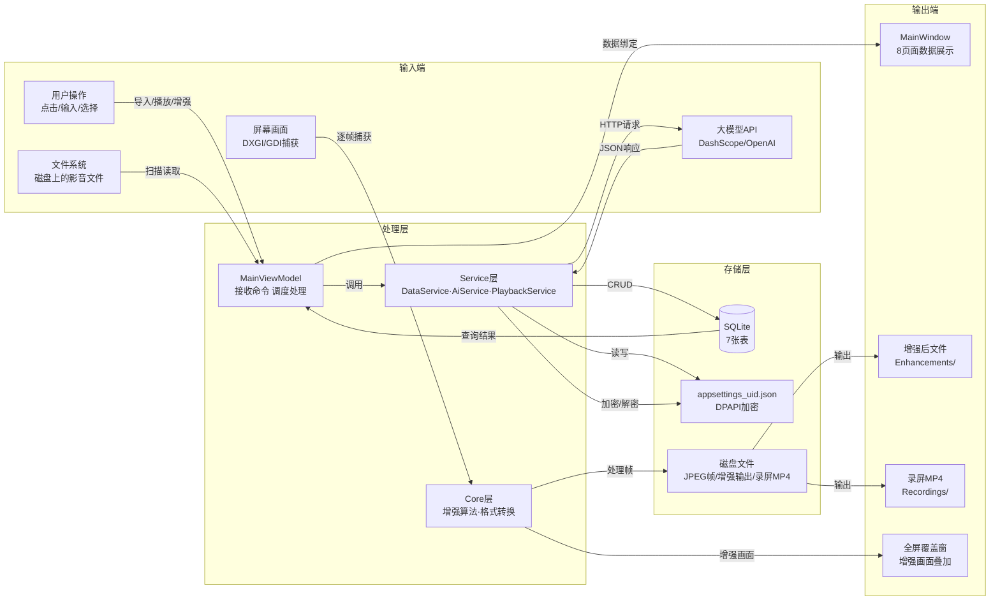

# 《Windows编程》课程设计报告

---

<div align="center">

# 影音智增强系统的设计与实现

<br>

**学　　校：暨南大学**

**学　　院：计算机科学系**

**课程名称：《Windows编程》**

<br>

| 项目 | 内容 |
|------|------|
| **设计题目** | 影音智增强系统的设计与开发 |
| **姓　　名** | （请填写） |
| **学　　号** | （请填写） |
| **学　　期** | 2025-2026 学年第二学期 |
| **学　　分** | 2 学分 |
| **任课老师** | 王娜 |
| **提交日期** | 2026 年 6 月 （请填写） |

<br>

**成　　绩：___________**

</div>

<div style="page-break-after: always;"></div>

---

## 1. 概述

### 1.1 简介

**影音智增强系统**是一款集**本地影音资产管理**与**AI 实时视觉增强**于一体的 Windows 桌面应用。随着智能手机、监控摄像头、行车记录仪等设备的普及，普通用户积累了大量影音文件，但其中相当比例的内容因拍摄环境（低光照、低对比度、有雾天气等）而画质不佳——"看不清、理还乱"成为普遍痛点。

本系统面向这一需求，提供了一站式解决方案：用户可将本地的图片、视频、音频文件批量导入系统形成个人影音资料库，利用系统内置的图像增强算法（线性拉伸 + ONNX 深度学习模型）实时提升屏幕画面或离线修复低质量文件，并借助多模态大语言模型实现内容的智能理解、自动摘要与规范管理，最终形成"获取→增强→管理→分享"的完整闭环。

系统采用 **.NET 10 WPF** 桌面框架、**MVVM** 架构模式、**SQLite** 本地数据库，支持可扩展的增强方法插件架构，整体代码量约 10,000 行 C# 和 2,500 行 XAML。

### 1.2 系统建设的目标

1. **一站式影音管家**：支持扫描、导入、分类、收藏、播放统计本地影音文件，构建个人多媒体资料库。
2. **多策略增强画面**：实现可扩展的增强方法插件架构，集成线性拉伸与 ONNX 深度学习模型（Multinex Nano），支持实时增强与离线处理。
3. **实时增强任意屏幕内容**：通过 DXGI Desktop Duplication 捕获屏幕画面，在透明覆盖窗口中实时显示增强结果，支持全局热键控制。
4. **离线内容修复**：对已保存的视频或图像文件进行增强处理，导出更清晰的版本并自动纳入管理库。
5. **AI 深度赋能**：集成多模态大语言模型，支持 AI 对话分析、图像生成编辑，并具备 API 不可用时的本地模板降级能力。
6. **录制与分享**：集成录屏功能，支持后处理增强，录制文件自动入库。

### 1.3 该文档的构成

本文档共分为五章：

- **第 1 章**：概述——介绍项目背景、建设目标和文档构成。
- **第 2 章**：系统的需求分析——描述目标客户、系统服务和运行要求。
- **第 3 章**：系统的设计与实现——详述数据库设计、功能模型、类结构及程序文件设计。
- **第 4 章**：程序运行——展示运行界面截图并附说明。
- **第 5 章**：附录——补充说明。

---

## 2. 系统的需求分析

### 2.1 目标客户描述

本系统的目标用户包括以下几类群体：

1. **普通家庭用户**：有大量家庭录像、旅行照片需要整理和修复的用户。他们希望以简单的方式管理影音文件，并自动改善低光照照片和视频的画质。
2. **安防与监控人员**：需要在低光、雾霾天气下查看监控或行车记录仪画面的用户。实时增强功能可帮助他们更快识别画面中的关键信息。
3. **影音爱好者**：经常观看在线低质量视频并希望实时提升画质的用户，或需要对旧影片进行画质修复的收藏者。
4. **内容创作者与教育工作者**：需要录制教学视频或直播内容，并希望在录制时或录制后改善画面质量的用户。
5. **视障用户群体**：结合 AI 语音描述功能理解画面内容，降低影像信息的获取门槛。

### 2.2 系统为用户提供的服务

系统提供以下八大功能模块的服务：

**(1) 影音管理模块**
- 文件导入：文件夹递归扫描、多文件选择导入
- 自动元数据提取（类型、尺寸、时长、文件大小）
- 搜索筛选（关键词 + 类型 + 收藏，三维组合）
- 收藏管理（单文件/批量，Favorites 表同步）
- 文件重命名（文件系统 + 数据库同步更新）
- 文件删除（三级确认对话框：取消 / 仅删记录 / 删源文件+记录）
- 文件播放（图片查看器 / 视频音频播放器，自动记录播放历史）
- 简介编辑（自由文本，持久化到数据库）
- 缩略图管理（自动生成 / 手动设置 / 批量生成 / 清空缓存）
- 详情面板（双击浮层，展示完整元数据）
- 播放记录（自动记录，最近播放快捷入口）
- 批量操作（收藏 / 删除 / 生成缩略图）
- 文件完整性校验（检测缺失文件 → 定位新路径或删除记录）

**(2) 用户系统模块**
- 用户注册与登录，SHA256 + 随机盐密码存储，恒定时间比较防时序攻击
- 多用户数据完全隔离（数据库查询按 UserId 过滤，配置文件按用户独立存储）
- 每个用户独立的 API Key 和路径配置

**(3) 图像增强模块**
- 增强方法注册中心（插件架构，新算法一行注册）
- 线性拉伸增强：像素值线性映射到全动态范围，纯 C# 实现，< 0.1ms/帧，对比度+亮度可调
- Multinex Nano ONNX 深度学习增强：超轻量 Retinex 网络（15K 参数），CPU 推理

**(4) 实时屏幕增强模块**
- 全屏透明覆盖窗口（Layered Window + WS_EX_TRANSPARENT 鼠标穿透）
- DXGI Desktop Duplication（GPU 零拷贝）+ GDI 自动回退
- 防递归捕获（WDA_EXCLUDEFROMCAPTURE）
- F11 全局热键安全退出
- 会话记录持久化（开始/结束时间、使用方法、持续时长）
- 参数实时可调（对比度、亮度）

**(5) 离线文件增强模块**
- 单图片增强：选择方法 → 预览对比 → 确认导出 → 自动入库
- 视频增强：FFmpeg 解帧 → 逐帧增强 → 合帧 + 音轨 → 入库
- 增强预览与导出（选图 → 预览 → 保存并入库）
- 可取消（处理中随时中止）
- 增强文件自动关联源文件（`SourceFileId`），参数持久化至日志

**(6) 屏幕录制模块**
- 全屏捕获（DXGI Desktop Duplication → GDI CopyFromScreen 回退）
- 后处理增强：录制时不增强保证帧率，停止后逐帧增强再编码
- 后处理增强可中途取消（直接使用原始帧编码）
- 编码器自动降级：h264_nvenc → h264_qsv → h264_amf → libx264 → mpeg4
- 录制文件自动入库，录制历史列表，可浏览输出目录

**(7) AI 智能模块**
- AI 对话：OpenAI 兼容 API，多供应商支持（通义千问/DeepSeek/Ollama/智谱等）
- 多模态：图片 Base64 嵌入，视频 FFmpeg 抽关键帧
- 快捷预设：AI 简介、数据摘要
- 对话清空
- API 未配置或失败时自动降级为本地模板分析（基于文件元数据生成回复）
- AI 图像编辑：文生图 / 图生图，支持通义万相/OpenAI 兼容 API
- 生成结果保存并自动入库

**(8) 数据统计模块**
- 9 项仪表盘：文件总数、图片、视频、音频、增强次数、实时增强、录屏次数、总播放、收藏数
- 依赖检查（自动检测并下载 FFmpeg）
- 缓存清理（删除 30 天过期缩略图）
- 文件批量校验（遍历检查，缺失可定位或删除）
- 快捷跳转到 AI 对话页

**(9) 系统设置模块**
- AI Chat 配置（Endpoint 预设下拉框 / API Key DPAPI 加密 / 模型名 / 连通性测试）
- AI Edit 配置（Endpoint / API Key / 模型 / 输出格式）
- 保存路径配置（录制 / 增强输出 / 缩略图缓存）
- 一键重置默认值

### 2.3 系统的要求

**(1) 软件运行环境**
- 操作系统：Windows 10 / 11 (x64)
- 运行时：自包含发布，无需安装 .NET Runtime
- 附加依赖：FFmpeg（可选自动下载）、ONNX Runtime（已嵌入发布包）

**(2) 硬件要求**
- CPU：x64 处理器，建议 2.0 GHz 以上
- 内存：建议 4 GB 以上
- 显卡：支持 DXGI 1.2+ 的 GPU（用于硬件屏幕捕获和硬件编码加速），集成显卡亦可
- 磁盘空间：安装包约 300 MB，运行数据视影音库规模而定

**(3) 开发环境**
- .NET 10 SDK
- Visual Studio 2022 或 VS Code
- NuGet 包：CommunityToolkit.Mvvm 8.4.2、Entity Framework Core 10.0.8、SQLite、ONNX Runtime 1.20.0、NAudio 2.2.1、TagLibSharp 2.3.0、Xabe.FFmpeg 6.0.2

### 2.4 系统的功能结构

系统整体功能结构如下图所示：

```
影音智增强系统
├── 用户管理
│   ├── 用户注册（SHA256 + 随机盐哈希）
│   ├── 用户登录（恒定时间比较，防时序攻击）
│   └── 多用户数据隔离（数据库 UserId 过滤 + 独立配置文件）
│
├── 影音管理
│   ├── 文件导入（文件夹递归扫描 / 多选导入）
│   ├── 元数据自动提取（类型、尺寸、时长、大小）
│   ├── 搜索筛选（关键词 + 类型 + 收藏）
│   ├── 收藏管理（单文件 / 批量，Favorites 同步）
│   ├── 文件重命名（文件系统 + 数据库同步）
│   ├── 文件删除（三级确认：取消/仅删记录/删源文件）
│   ├── 文件播放（图片查看器 / 视频音频播放器）
│   ├── 简介编辑
│   ├── 缩略图管理（自动生成/手动设置/批量生成/清空缓存）
│   ├── 详情面板（双击浮层，完整元数据）
│   ├── 播放记录（最近播放快捷入口）
│   ├── 批量操作（收藏 / 删除 / 生成缩略图）
│   └── 文件完整性校验（缺失→定位或删除记录）
│
├── 图像增强
│   ├── 实时增强（全屏透明覆盖）
│   │   ├── 屏幕捕获（DXGI Desktop Duplication → GDI 回退）
│   │   ├── 鼠标穿透（WS_EX_TRANSPARENT）+ 防递归（WDA_EXCLUDEFROMCAPTURE）
│   │   ├── F11 全局热键退出
│   │   └── 会话记录持久化
│   ├── 离线增强
│   │   ├── 单图片增强（选择方法 → 预览对比 → 导出入库）
│   │   ├── 视频逐帧增强（FFmpeg 解帧 → 增强 → 合帧+音轨）
│   │   └── 可取消
│   └── 增强方法注册中心（插件架构）
│       ├── 线性拉伸（纯 C#，< 0.1ms/帧，对比度+亮度可调）
│       └── Multinex Nano（ONNX Runtime，15K 参数 Retinex 网络）
│
├── 屏幕录制
│   ├── 全屏捕获（DXGI → GDI 回退）
│   ├── 后处理增强（录制时不增强保证帧率，停止后逐帧增强）
│   ├── 增强可取消（直接使用原始帧编码）
│   ├── 编码器自动降级（nvenc → qsv → amf → libx264 → mpeg4）
│   └── 录制历史（自动入库，可浏览输出目录）
│
├── AI 智能
│   ├── 多模态对话（OpenAI 兼容 API，多供应商）
│   ├── 图片 Base64 嵌入 + 视频关键帧提取
│   ├── 快捷预设（AI 简介 / 数据摘要）
│   ├── 本地模板降级（API 不可用时兜底）
│   ├── AI 图像编辑（文生图 / 图生图）
│   └── 生成结果保存并自动入库
│
├── 数据统计
│   ├── 9 项仪表盘（总数、图片、视频、音频、增强、实时增强、录屏、播放、收藏）
│   ├── 依赖检查（自动下载 FFmpeg）
│   ├── 缓存清理（30 天过期缩略图）
│   └── 文件批量校验（缺失定位或删除）
│
└── 系统设置
    ├── AI Chat 配置（Endpoint / Key / Model，含连通性测试）
    ├── AI Edit 配置（Endpoint / Key / Model / Format）
    ├── 保存路径配置（录制 / 增强 / 缩略图，各带浏览）
    └── 一键重置默认值
```

---

## 3. 系统的设计与实现

### 3.1 系统的数据模型与数据库设计

#### 3.1.1 数据库选型

系统采用 **SQLite** 作为本地数据库引擎，通过 **Entity Framework Core 10** 进行对象关系映射。选择 SQLite 的核心理由是：
- 零配置部署——单文件数据库，无需安装服务器实例
- 适合桌面单机应用场景——本系统是单用户桌面应用，无多用户并发写入
- 备份简便——复制 `.sqlite` 文件即可
- EF Core 完全支持——包括 Migration、LINQ 查询、级联操作等

#### 3.1.2 概念数据模型（CDM）

概念数据模型独立于任何数据库管理系统，描述系统中有哪些核心实体、实体之间的关系和基数。

**实体识别**：从系统需求中抽象出 7 个核心实体——

| 实体 | 含义 | 产生时机 |
|------|------|---------|
| **用户（User）** | 系统使用者 | 注册时创建 |
| **媒体文件（MediaFile）** | 影音文件记录 | 导入/增强生成/录制生成时创建 |
| **播放记录（PlayHistory）** | 一次播放行为 | 双击播放时创建 |
| **增强日志（EnhancementLog）** | 一次增强操作 | 执行增强时创建 |
| **录屏记录（Recording）** | 一次屏幕录制 | 停止录制时创建 |
| **收藏记录（Favorite）** | 一次收藏行为 | 勾选收藏时创建 |
| **实时增强会话（RealtimeSession）** | 一次全屏增强 | 启动/停止全屏增强时创建 |

**实体关系与基数**：

```
User 1 ──── N MediaFile        （一个用户拥有多个媒体文件）
User 1 ──── N PlayHistory      （一个用户有多次播放记录）
User 1 ──── N EnhancementLog   （一个用户有多次增强操作）
User 1 ──── N Recording        （一个用户有多次录屏）
User 1 ──── N Favorite         （一个用户有多个收藏）
User 1 ──── N RealtimeSession  （一个用户有多次全屏增强会话）

MediaFile 1 ──── N PlayHistory    （一个文件可被多次播放）
MediaFile 1 ──── N EnhancementLog （一个文件可被多次增强）
MediaFile 1 ──── 1 Recording      （一个 MP4 文件最多对应一条录屏记录）
MediaFile 1 ──── 1 Favorite       （一个文件最多被收藏一次）
MediaFile 1 ──── N MediaFile      （自引用：一个源文件可产生多个增强文件）
```

#### 3.1.3 逻辑数据模型（LDM）

逻辑数据模型将概念模型中的实体细化为带属性的关系模式，确定主键、外键和约束，但仍不绑定具体数据库产品。

**各实体属性定义**：

- **User**（用户）：`Id`(PK), `Username`(UNIQUE), `PasswordHash`, `Salt`, `DisplayName`, `CreatedAt`, `LastLoginAt`
- **MediaFile**（媒体文件）：`Id`(PK), `Title`, `FilePath`, `Type`, `FileFormat`, `FileSize`, `Width`, `Height`, `Duration`, `SourceFileId`(FK→MediaFile), `IsFavorite`, `Description`, `ThumbnailPath`, `DateAdded`, `DateModified`, `UserId`(FK→User)
- **PlayHistory**（播放记录）：`Id`(PK), `MediaFileId`(FK→MediaFile), `PlayedAt`, `UserId`(FK→User)
- **EnhancementLog**（增强日志）：`Id`(PK), `MediaFileId`(FK→MediaFile), `MethodName`, `OutputPath`, `ParametersJson`, `CreatedAt`, `UserId`(FK→User)
- **Recording**（录屏记录）：`Id`(PK), `MediaFileId`(FK→MediaFile, UNIQUE), `Title`, `FilePath`, `Duration`, `FileSize`, `IsEnhanced`, `AudioSource`, `CreatedAt`, `UserId`(FK→User)
- **Favorite**（收藏记录）：`Id`(PK), `MediaFileId`(FK→MediaFile, UNIQUE), `CreatedAt`, `UserId`(FK→User)
- **RealtimeSession**（实时增强会话）：`Id`(PK), `UserId`(FK→User), `MethodName`, `StartedAt`, `StoppedAt`, `DurationSeconds`

**规范化分析**：所有关系均满足第三范式（3NF）——非主属性完全函数依赖于主键，不存在传递依赖。例如 `PlayHistory` 表的 `PlayedAt` 完全依赖于 `Id`，而非依赖于关联的 `MediaFileId`。

**Cassandra 警告**：注意 `MediaFile.IsFavorite` 与 `Favorite` 表之间存在数据冗余。`IsFavorite` 是布尔标志，用于快速筛选（`WHERE IsFavorite=1`）；`Favorite` 表记录精确的收藏时间戳。这是有意为之的反规范化，以性能换取一致性维护成本。

**E-R 图**（实体-联系图）：

```
                              ┌─────────────────────────────┐
                              │           Users             │
                              │  Id (PK)                    │
                              │  Username (UNIQUE)          │
                              │  PasswordHash               │
                              │  Salt                       │
                              └──────┬──────────────────────┘
                                     │ 1
                                     │
          ┌──────────┬──────────┬────┴──────┬───────────┬──────────┐
          │          │          │           │           │          │
          ▼ N        ▼ N        ▼ N         ▼ N         ▼ N        ▼ N
 ┌─────────────┐ ┌──────────┐ ┌─────────┐ ┌─────────┐ ┌─────────┐ ┌────────────────┐
 │ MediaFiles  │ │Play-     │ │Enhance- │ │Record-  │ │Favorites│ │RealtimeSessions│
 │─────────────│ │Histories │ │mentLogs │ │ings     │ │─────────│ │────────────────│
 │ Id (PK)     │ │Id (PK)   │ │Id (PK)  │ │Id (PK)  │ │Id (PK)  │ │Id (PK)         │
 │ FilePath    │ │MediaFile │ │MediaFile│ │MediaFile│ │MediaFile│ │UserId (FK)     │
 │ Type        │ │ Id (FK)  │ │ Id (FK) │ │ Id (FK) │ │ Id (FK) │ │MethodName      │
 │ FileSize    │ │UserId(FK)│ │Method   │ │ UNIQUE  │ │ UNIQUE  │ │StartedAt       │
 │ Width/Height│ │PlayedAt  │ │Name     │ │Title    │ │UserId   │ │StoppedAt       │
 │ Duration    │ │          │ │Output   │ │Duration │ │ (FK)    │ │DurationSeconds │
 │ IsFavorite  │ │          │ │Path     │ │FileSize │ │CreatedAt│ │                │
 │ SourceFile  │ │          │ │Params   │ │IsEnhancd│ │         │ │                │
 │  Id (自FK)  │ │          │ │UserId   │ │AudioSrc │ │         │ │                │
 │ UserId (FK) │ │          │ │ (FK)    │ │UserId   │ │         │ │                │
 └─────────────┘ └──────────┘ │CreatedAt│ │ (FK)    │ │         │ └────────────────┘
        │                     └─────────┘ │CreatedAt│ │         │
        │ 1                              └─────────┘ └─────────┘
        │
        │ N (自引用：SourceFileId → Id, ON DELETE SET NULL)
        └──────────────────────────────────────► MediaFiles (Enhanced Files)
```

#### 3.1.4 物理数据模型（PDM）

物理数据模型将逻辑模型映射到 SQLite 的具体实现。系统共建立 **7 张数据表**，各表结构如下：

**表一：Users（用户表）**

| 字段名 | 类型 | 约束 | 说明 |
|--------|------|------|------|
| Id | INTEGER | PRIMARY KEY, AUTOINCREMENT | 用户唯一标识 |
| Username | TEXT | NOT NULL, UNIQUE INDEX | 用户名 |
| PasswordHash | TEXT | NOT NULL | SHA256 密码哈希（Base64） |
| Salt | TEXT | NOT NULL | 随机盐值（Base64） |
| DisplayName | TEXT | NULL | 显示名称 |
| CreatedAt | TEXT | NOT NULL | 注册时间 |
| LastLoginAt | TEXT | NULL | 最后登录时间 |

**表二：MediaFiles（媒体文件表）**

| 字段名 | 类型 | 约束 | 说明 |
|--------|------|------|------|
| Id | INTEGER | PRIMARY KEY, AUTOINCREMENT | 文件唯一标识 |
| Title | TEXT | NOT NULL | 标题（默认为文件名） |
| FilePath | TEXT | NOT NULL | 文件完整路径 |
| Type | TEXT | NOT NULL | 类型：图片/视频/音频 |
| FileFormat | TEXT | NOT NULL | 扩展名，如 .mp4 |
| FileSize | INTEGER | NOT NULL | 文件大小（字节） |
| Width | INTEGER | NULL | 图像/视频宽度 |
| Height | INTEGER | NULL | 图像/视频高度 |
| Duration | TEXT | NULL | 时长（hh:mm:ss 或 mm:ss） |
| SourceFileId | INTEGER | NULL, FK→MediaFiles.Id, ON DELETE SET NULL | 源文件ID（增强来源） |
| IsFavorite | INTEGER | NOT NULL, DEFAULT 0 | 是否收藏 |
| Description | TEXT | NULL | 描述/AI摘要 |
| ThumbnailPath | TEXT | NULL | 缩略图缓存路径 |
| DateAdded | TEXT | NOT NULL | 导入时间 |
| DateModified | TEXT | NOT NULL | 文件修改时间 |
| UserId | INTEGER | NOT NULL, FK→Users.Id, CASCADE | 所属用户 |

> **复合唯一索引**：`(FilePath, UserId)` — 同一用户不得重复导入相同路径的文件，但不同用户可以导入同一文件。

**表三：PlayHistories（播放记录表）**

| 字段名 | 类型 | 约束 | 说明 |
|--------|------|------|------|
| Id | INTEGER | PRIMARY KEY, AUTOINCREMENT | 记录ID |
| MediaFileId | INTEGER | NOT NULL, FK→MediaFiles.Id, CASCADE | 媒体文件ID |
| PlayedAt | TEXT | NOT NULL | 播放时间 |
| UserId | INTEGER | NOT NULL, FK→Users.Id, CASCADE | 用户ID |

**表四：EnhancementLogs（增强日志表）**

| 字段名 | 类型 | 约束 | 说明 |
|--------|------|------|------|
| Id | INTEGER | PRIMARY KEY, AUTOINCREMENT | 日志ID |
| MediaFileId | INTEGER | NOT NULL, FK→MediaFiles.Id, CASCADE | 源文件ID |
| MethodName | TEXT | NOT NULL | 增强方法名称 |
| OutputPath | TEXT | NOT NULL | 增强输出文件路径 |
| ParametersJson | TEXT | NULL | 参数JSON（如`{"contrast":1.5}`） |
| CreatedAt | TEXT | NOT NULL | 增强时间 |
| UserId | INTEGER | NOT NULL, FK→Users.Id, CASCADE | 用户ID |

**表五：Recordings（录屏记录表）**

| 字段名 | 类型 | 约束 | 说明 |
|--------|------|------|------|
| Id | INTEGER | PRIMARY KEY, AUTOINCREMENT | 记录ID |
| MediaFileId | INTEGER | NOT NULL, UNIQUE, FK→MediaFiles.Id, CASCADE | 关联的媒体文件 |
| Title | TEXT | NOT NULL | 录制标题 |
| FilePath | TEXT | NOT NULL | 录制文件路径 |
| Duration | TEXT | NOT NULL | 时长（mm:ss） |
| FileSize | INTEGER | NOT NULL | 文件大小 |
| IsEnhanced | INTEGER | NOT NULL | 是否已增强 |
| AudioSource | TEXT | NOT NULL | 音频来源：系统/麦克风/混合/无 |
| CreatedAt | TEXT | NOT NULL | 录制时间 |
| UserId | INTEGER | NOT NULL, FK→Users.Id, CASCADE | 用户ID |

**表六：Favorites（收藏记录表）**

| 字段名 | 类型 | 约束 | 说明 |
|--------|------|------|------|
| Id | INTEGER | PRIMARY KEY, AUTOINCREMENT | 记录ID |
| MediaFileId | INTEGER | NOT NULL, UNIQUE, FK→MediaFiles.Id, CASCADE | 媒体文件ID |
| CreatedAt | TEXT | NOT NULL | 收藏时间 |
| UserId | INTEGER | NOT NULL, FK→Users.Id, CASCADE | 用户ID |

**表七：RealtimeSessions（实时增强会话表）**

| 字段名 | 类型 | 约束 | 说明 |
|--------|------|------|------|
| Id | INTEGER | PRIMARY KEY, AUTOINCREMENT | 会话ID |
| UserId | INTEGER | NOT NULL, FK→Users.Id, CASCADE | 用户ID |
| MethodName | TEXT | NOT NULL | 使用的增强方法 |
| StartedAt | TEXT | NOT NULL | 开始时间 |
| StoppedAt | TEXT | NULL | 停止时间（NULL=异常退出） |
| DurationSeconds | REAL | NOT NULL | 持续秒数 |

#### 3.1.5 数据操作要点

- 所有查询均按 `UserId` 过滤，确保多用户数据隔离
- 文件导入时通过 `(FilePath, UserId)` 复合唯一约束自动去重
- 所有子表均设置 `ON DELETE CASCADE`，删除用户或文件时自动清理关联数据
- `MediaFiles.SourceFileId` 为自引用外键，删除源文件时设为 `NULL`（`SET NULL`），而非级联删除增强文件
- `MediaFile.IsFavorite` 与 `Favorites` 表双写保持同步

#### 3.1.6 数据流分析

从用户操作到数据存储，系统共有九条核心数据流。

**数据流总览**：



**五类数据输入**：

| 序号 | 输入类型 | 具体内容 | 进入点 |
|------|---------|---------|--------|
| I1 | 用户输入 | 账号密码、API Key、搜索关键词、类型筛选、收藏过滤、增强参数（对比度/亮度） | UI 控件 → ViewModel 属性 |
| I2 | 本地磁盘媒体 | 图片/视频/音频文件的二进制数据、文件元数据（尺寸、时长、大小） | FileScanService → DataService |
| I3 | 硬件捕获 | DXGI/GDI 屏幕 RGBA 像素帧（如 1920×1080×4 字节）、系统时间戳 | DxgiScreenCapture → FullscreenEnhanceWindow / ScreenRecorder |
| I4 | 第三方工具输出 | FFmpeg 解帧 JPEG、ONNX Runtime 修复后的像素数组、LLM 返回的文本摘要 | Core 增强算法 / AiService |
| I5 | 系统内置数据 | 数据库自增主键 Id、随机 Salt 加密盐、DateTime 时间戳、Guid 临时目录名 | 各 Service 内部生成 |

**五层处理链路**：

| 层 | 职责 | 代表文件 |
|------|------|---------|
| UI 表现层 | 接收用户原始交互（点击、输入、选择），渲染画面帧 | `MainWindow.xaml`、`LoginWindow.xaml` |
| ViewModel 视图模型层 | 封装业务参数（搜索词→筛选条件、滑块值→对比度参数），将原始输入转换为 Service 可理解的参数 | `MainViewModel`（5 partial） |
| Services 业务服务层 | 执行具体操作：认证校验、文件扫描去重、AI 对话请求、录屏帧调度、数据库读写 | `DataService`、`AiService`、`ScreenRecorder` |
| Core 增强算法层 | 逐像素图像处理：线性拉伸（直方图→线性映射）、ONNX 推理（BGRA→NCHW→推理→BGRA）、格式缩放 | `LinearStretchMethod`、`MultinexNanoMethod`、`OnnxModelHelper` |
| Data 数据持久层 | EF Core 实体映射，SQLite 增删改查、唯一约束校验、级联删除 | `AppDbContext`、`Migrations/` |

**五类数据输出**：

| 序号 | 输出类型 | 具体内容 | 去向 |
|------|---------|---------|------|
| O1 | UI 界面 | DataGrid 媒体列表、播放记录列表、仪表盘 9 项统计数字、AI 摘要 Markdown、进度条/状态文本 | `MainWindow` 各页面控件 |
| O2 | 本地磁盘 | 增强后的图片（Enhancements/）、增强后的视频 MP4、录屏 MP4（Recordings/）、缩略图缓存（Thumbnails/）、配置文件（appsettings_uid.json） | 磁盘文件系统 |
| O3 | 大模型 API | 选中图片/视频关键帧的 Base64 编码、对话历史 messages、生图 prompt、ref_img | HTTP POST → DashScope / OpenAI 端点 |
| O4 | SQLite 数据库 | 7 张表的全部结构化数据 | `MediaEnhancerDb.sqlite` 文件 |
| O5 | 内存缓存 | 全屏增强当前帧 `byte[]`、AI 对话临时 `ChatMessage` 列表、DataGrid 查询结果 `ObservableCollection` | 程序内存，随进程释放 |

**（1）文件导入流**：用户选择文件夹 → `FileScanService` 递归扫描磁盘 → 提取元数据（`MediaFileUtils.GetImageDimensions/GetVideoDuration`） → `DataService.AddMediaFilesAsync` 批量写入 SQLite → `LoadDataAsync` 刷新 DataGrid。

**（2）播放记录流**：用户双击文件 → `PlaybackService.Play` 打开播放窗口 → `DataService.AddPlayHistoryAsync` 写入播放记录 → 关闭后 `LoadRecentPlaysAsync` + `LoadStatisticsAsync` 刷新最近播放列表和仪表盘。

**（3）图像离线增强流**：用户右键增强 → `EnhanceFile` 读取 `BitmapSource` → 调用增强算法（`Enhance(bitmap)` 或 `EnhanceAsync(bitmap)`） → `JpegBitmapEncoder` 保存增强文件到磁盘 → `ImportFilePathsAsync` 入库（新 `MediaFile` + `EnhancementLog`，含 `SourceFileId` 关联） → 刷新文件列表。

**（4）视频逐帧增强流**：用户右键增强视频 → `VideoEnhancer.EnhanceAsync` → FFmpeg 解帧为 JPEG → WPF `BitmapImage` 逐帧加载 → 调用 `Enhance(byte[])` → WPF `JpegBitmapEncoder` 逐帧写回 → FFmpeg 合帧并合并音轨 → `ImportFilePathsAsync` 入库 + `AddEnhancementLogAsync` 写日志。

**（5）屏幕录屏流**：用户开始录制 → `ScreenRecorder` 启动 DXGI/GDI 捕获 → 逐帧保存原始 JPEG → 停止后逐帧增强（可选，可取消） → FFmpeg 编码为 MP4 → `ImportFilePathsAsync(MP4)` 入库 → `AddRecordingAsync` 追加录屏专属信息。

**（6）全屏实时增强流**：用户启动全屏增强 → `FullscreenEnhanceWindow` 创建透明覆盖窗口 → DXGI 捕获屏幕纹理 → `EnhanceRegistry.Current.Enhance(byte[])` 逐帧增强 → `BitmapSource.Create` 渲染到窗口 → F11 全局热键退出 → `RealtimeSession` 记录会话。

**（7）AI 对话流**：用户输入文本并勾选文件 → `SendAiMessage` → `AiService.ChatAsync` 构建 messages（历史 + 选中图片/视频关键帧的 Base64 嵌入） → HTTP POST 到配置的大模型端点 → JSON 解析 `choices[0].message.content` → 追加到 `AiMessages` → Markdown 渲染。API 不可用时自动降级为模板分析。

**（8）用户认证流**：用户输入用户名密码 → `AuthService.LoginAsync` → 查询 `Users` 表 → `SHA256(Salt + 密码)` 比对 `PasswordHash` → 恒定时间比较防时序攻击 → 成功后 `CurrentUser` 设置 → 所有后续数据库操作均带 `UserId` 过滤。

**（9）系统设置流**：用户在设置页面修改 API 端点、密钥、模型名或保存路径 → `MainViewModel` 属性变更 → `AiService.ConfigureChat/ConfigureEdit` 更新内存中的端点/密钥/模型 → `AppConfig.Save` 将配置序列化为 JSON → API 密钥经 `SecureStorage.Protect`（DPAPI）加密后写入 `appsettings_{userId}.json` → 下次启动时 `AiService` 构造函数调用 `Config.Load` → `SecureStorage.Unprotect` 解密回内存。保存路径（录制/增强/缩略图）同理，但在 `AppConfig.Save` 时不加密，直接明文存储。

### 3.2 系统的功能模型

#### 3.2.1 功能模块图

```mermaid
flowchart TB
    A["影音智增强系统"]

    A --> B["用户管理"]
    A --> C["影音管理"]
    A --> D["图像增强"]
    A --> E["屏幕录制"]
    A --> F["AI 智能"]
    A --> G["数据统计"]
    A --> H["系统设置"]

    B --> B1["用户注册<br/>SHA256+Salt"]
    B --> B2["用户登录<br/>恒定时间比较"]
    B --> B3["多用户数据隔离<br/>UserId过滤+独立配置"]

    C --> C1["文件导入<br/>扫描/多选"]
    C --> C2["搜索筛选<br/>关键词+类型+收藏"]
    C --> C3["收藏管理<br/>单文件/批量"]
    C --> C4["文件操作<br/>播放/重命名/删除"]
    C --> C5["缩略图管理<br/>自动生成/手动设置"]
    C --> C6["文件校验<br/>缺失定位"]

    D --> D1["线性拉伸<br/>纯C# &lt;0.1ms"]
    D --> D2["Multinex Nano<br/>ONNX 15K参数"]
    D --> D3["实时全屏增强<br/>DXGI+透明覆盖"]
    D --> D4["离线文件增强<br/>图片/视频逐帧"]
    D --> D5["增强预览<br/>选图→预览→导出"]

    E --> E1["全屏捕获<br/>DXGI→GDI回退"]
    E --> E2["后处理增强<br/>录制后逐帧处理"]
    E --> E3["编码器降级<br/>nvenc→qsv→amf→x264"]
    E --> E4["录制历史<br/>自动入库"]

    F --> F1["AI对话<br/>多模态Base64嵌入"]
    F --> F2["AI图像编辑<br/>文生图/图生图"]
    F --> F3["本地模板降级<br/>API不可用时兜底"]

    G --> G1["9项仪表盘<br/>文件/图片/视频/音频"]
    G --> G2["使用统计<br/>增强/录屏/播放/收藏"]
    G --> G3["依赖检查<br/>自动下载FFmpeg"]
    G --> G4["缓存清理<br/>30天过期缩略图"]

    H --> H1["API配置<br/>Endpoint/Key/Model"]
    H --> H2["保存路径<br/>录制/增强/缩略图"]
    H --> H3["连通性测试<br/>一键重置"]
```



#### 3.2.2 主界面页面布局

系统主界面采用左侧导航栏 + 右侧内容区的经典布局，共 **8 个功能页面**：

| 页面索引 | 页面名称 | 主要功能 |
|:--:|------|------|
| 0 | 数据统计 | 9 项仪表盘、快捷入口、依赖检查、缓存清理 |
| 1 | 文件管理 | DataGrid 列表、搜索筛选、详情面板、批量操作 |
| 2 | 离线增强 | 方法选择、参数调节、预览对比、增强历史 |
| 3 | 实时增强 | 全屏增强开关、方法选择、参数滑块、会话历史 |
| 4 | 屏幕录制 | 录制控制、状态指示、增强开关、录制历史 |
| 5 | AI 对话 | 多轮对话、文件上下文、预设提示、Markdown 渲染 |
| 6 | AI 编辑 | 图像选择、提示词输入、生成结果预览与保存 |
| 7 | 系统设置 | API 配置、路径设置、保存/重置 |

### 3.3 系统的类之间的关系

系统由四层核心类构成，类之间的调用关系已在 §3.1.6 数据流总览中描述。详见 [项目架构图](#) 及项目源码中的 `Core/`、`Services/`、`ViewModels/` 目录。

---

## 4. 程序运行

### 4.1 运行界面截图说明

> **说明**：以下为程序实际运行截图的位置。请运行程序后截取各主要页面，替换为实际截图。

#### (1) 登录/注册界面
本界面提供用户注册与登录功能：输入用户名、显示名称、密码，点击注册或登录按钮进入主界面。
> [图 4-1：登录/注册窗口截图]

#### (2) 数据统计页面
九宫格展示各项统计数据（文件总数、分类数量、增强次数、录屏次数、播放次数、收藏数）；下方提供快捷入口和系统维护按钮。
> [图 4-2：数据统计页面截图]

#### (3) 文件管理页面
左侧 DataGrid 展示全部文件（含缩略图、类型、时长等列），支持搜索、类型筛选、收藏过滤、多选批量操作；右侧浮动详情面板展示文件完整信息并提供操作按钮。
> [图 4-3：文件管理页面截图]

#### (4) 离线增强页面
左侧方法选择与参数调节（对比度/亮度滑块），中间预览增强效果，右侧使用指南与增强历史记录。
> [图 4-4：离线增强页面截图]

#### (5) 实时增强页面
中间放置开始/停止按钮、方法选择、参数滑块；下方展示实时增强会话历史。
> [图 4-5：实时增强页面截图]

#### (6) 全屏增强效果
透明覆盖窗口显示实时增强后的屏幕画面，F11 热键退出。叠加层不影响鼠标操作（鼠标穿透）。
> [图 4-6：全屏增强效果截图]

#### (7) 屏幕录制页面
左侧录制控制区（开始/停止按钮、状态指示、时长显示），右侧录制历史列表。
> [图 4-7：屏幕录制页面截图]

#### (8) AI 对话页面
对话消息列表（AI 左侧气泡、用户右侧气泡）、底部输入区（文件附加、文本输入、发送），Markdown 渲染支持。
> [图 4-8：AI 对话页面截图]

#### (9) AI 编辑页面
左侧选择图像与输入提示词，右侧显示生成结果并提供保存按钮。
> [图 4-9：AI 编辑页面截图]

#### (10) 系统设置页面
左侧 AI Chat/Edit 配置（Endpoint、API Key、模型名），右侧保存路径设置。
> [图 4-10：系统设置页面截图]

#### (11) 播放器与图片查看器
MediaPlayer 窗口（播放控制、全屏、快捷键）和 ImageViewer 窗口（缩放、拖动、导航）。
> [图 4-11：播放器与图片查看器截图]

### 4.2 运行说明

1. 启动程序后，首先出现登录/注册窗口。
2. 首次使用请点击"注册"创建账号，输入用户名（至少 2 字符）、显示名称、密码（至少 4 字符）。
3. 登录后进入主界面，默认显示"数据统计"页面。
4. 进入"数据统计"页面 → 点击"检查依赖"自动下载 FFmpeg（如尚未安装）。
5. 进入"文件管理"页面 → 点击"选择文件夹"导入影音文件。
6. 导入后即可使用各功能模块：文件管理、增强处理、屏幕录制、AI 对话/编辑等。

---

## 5. 附录

### 5.1 系统的主要技术特点

1. **可扩展的图像增强架构**：基于 `IEnhancementMethod` 接口的插件体系，新算法只需实现接口并注册即可接入，无需修改现有代码。
2. **双路径增强执行**：实时路径（byte[] 零 GC）与离线路径（BitmapSource）分离设计，同时满足高性能逐帧增强和高画质离线处理的需求。
3. **全屏透明增强覆盖**：基于 Layered Window + WS_EX_TRANSPARENT + WDA_EXCLUDEFROMCAPTURE 的组合方案，实现真正的鼠标穿透和防递归捕获。
4. **多用户数据完全隔离**：数据库查询层 + 配置文件层的双重隔离机制。
5. **AI 服务容错降级**：API 不可用时自动切换为本地模板分析，确保功能始终可用。
6. **多级编码器降级**：从硬件编码（NVENC/QSV/AMF）到软件编码（libx264/mpeg4）的自动降级链，覆盖不同 GPU 环境。
7. **安全的凭证存储**：密码 SHA256+Salt，API Key DPAPI 加密。

### 5.2 系统的局限性与未来改进

1. **录屏不含音频**：当前版本录屏仅捕获视频画面，未来的改进方向是集成 NAudio 实现系统音频和麦克风的同步录制。
2. **AI 对话历史未持久化**：ChatMessage 为纯内存模型，关闭程序后对话历史丢失。
3. **ONNX 模型数量有限**：当前仅集成一个 Multinex Nano 模型，未来可扩展更多模型（去雾、去噪、超分辨率等）。
4. **仅支持全屏捕获**：录屏和实时增强均面向全部屏幕，暂不支持区域选择。
5. **无 GPU 推理加速**：ONNX Runtime 当前使用 CPU 执行提供程序，未来可配置 CUDA/DirectML 提供程序。
6. **国际化**：当前界面仅支持中文，可扩展多语言支持。
7. **暗色主题**：当前仅提供浅色主题。

---

<div style="page-break-after: always;"></div>

## 参考文献

[1] 周纳. ASP动态网站编程与应用. 北京: 清华大学出版社, 2005.8

[2] Andrew Troelsen, Philip Japikse. Pro C# 10 with .NET 6: Foundational Principles and Practices in Programming. 11th ed. Apress, 2022.

[3] Adam Nathan. WPF 4.5 Unleashed. Sams Publishing, 2013.

[4] Microsoft Corporation. Entity Framework Core Documentation. https://learn.microsoft.com/en-us/ef/core/, 2026.

[5] Microsoft Corporation. CommunityToolkit.Mvvm Documentation. https://learn.microsoft.com/dotnet/communitytoolkit/mvvm/, 2026.

[6] ONNX Runtime Developers. ONNX Runtime Documentation. https://onnxruntime.ai/docs/, 2026.

---

> 电子文档命名：`（请填写学号）-（请填写姓名）-课程设计.rar`
